# Backlit PCB Art Lamp

A compact battery-powered PCB art lamp with adjustable LED backlighting, USB-C charging, USB-A power output, and a replaceable 21700 Li-ion battery.

The front artwork itself is a PCB. Different PCB layers are used to form the image, while a separate main board provides the LED backlight, power management, charging, output, and brightness control.

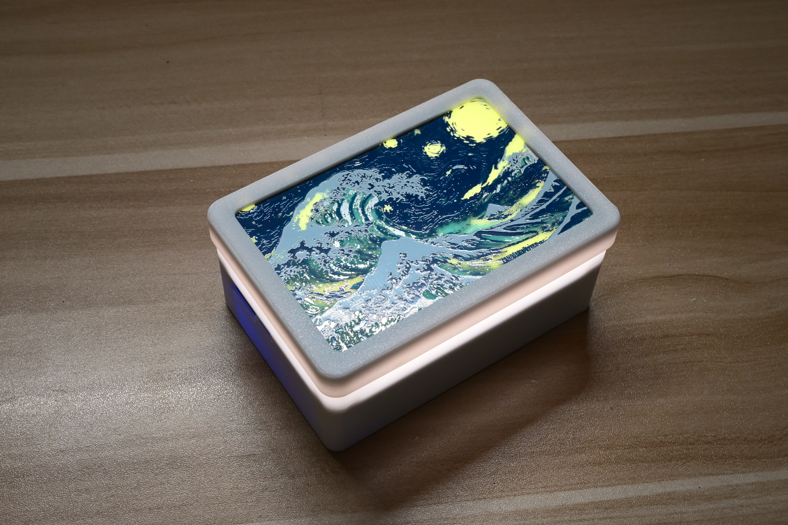


## Features

- Front PCB artwork with a layered translucent design
- 40 × 2835 neutral-white LEDs
- Adjustable LED brightness
- TLC555-based PWM dimming
- IP5306-based power management
- USB-C charging input
- USB-A 5 V power output
- Four-level battery indicator
- Replaceable 21700 Li-ion battery
- Battery reverse-polarity protection
- 3D-printed three-piece enclosure

The lamp can remain illuminated while charging through USB-C or while supplying power through USB-A.


## Final Assembly

### Light Off

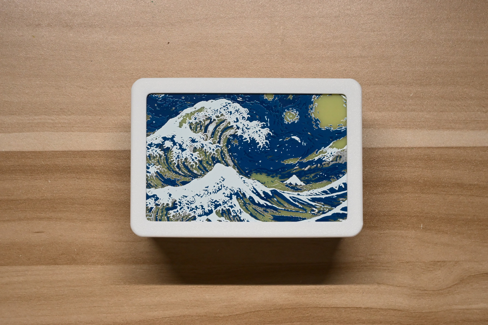

### Light On

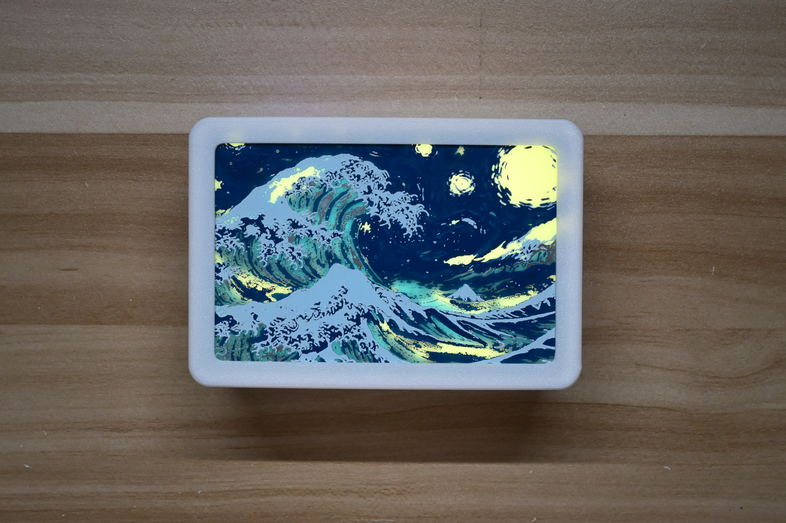

The appearance changes significantly when the backlight is enabled because the artwork uses the optical properties and colors of different PCB layers.


## Hardware Overview

The project consists of two PCBs:

1. A main board containing all electronic components and LEDs
2. A passive artwork PCB used as the front image

### Main Board

The main board contains:

- IP5306 power-management circuit
- TLC555 PWM brightness-control circuit
- 40-LED backlight array
- USB-A output
- USB-C charging input
- battery protection circuit
- reverse-polarity protection
- brightness potentiometer
- LED on/off switch
- power button
- four battery-level indicator LEDs
- 21700 battery holder

#### Component Side

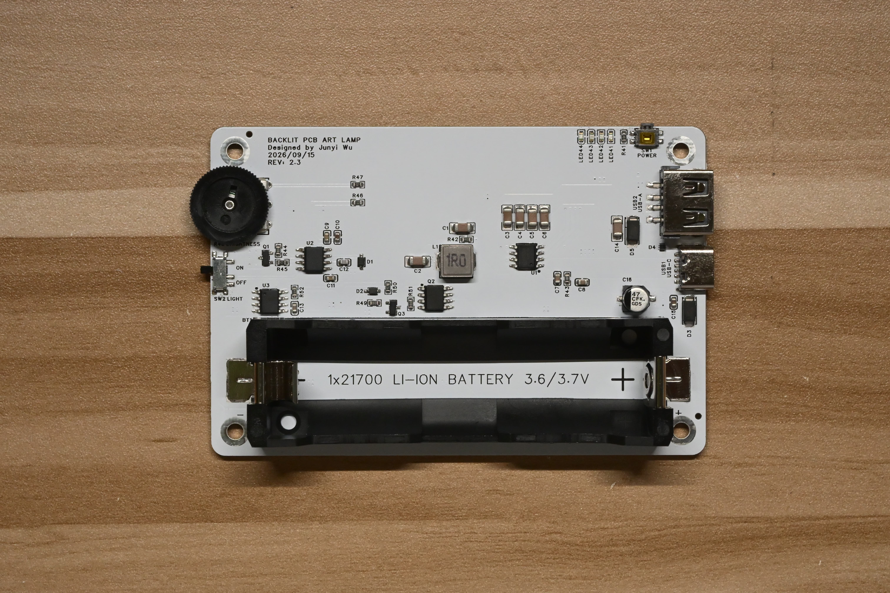

#### LED Side

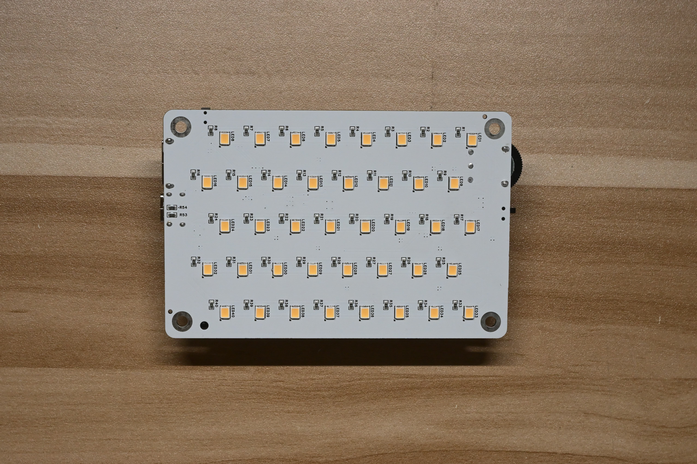

#### LEDs On

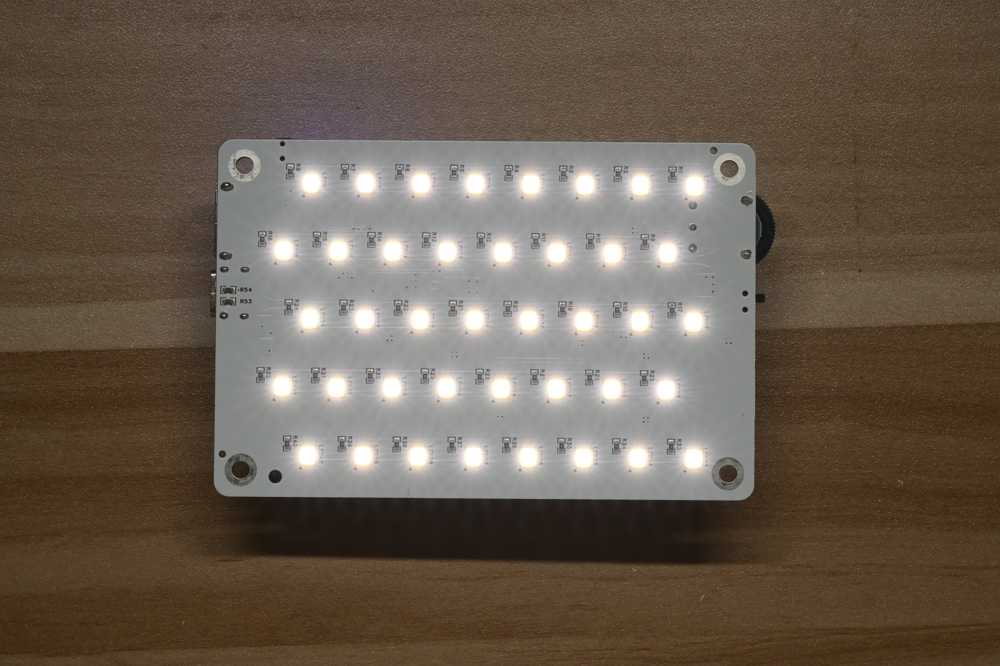

The main board uses a white solder mask, mainly to improve light reflection around the LED array. The exact solder-mask color is not critical to electrical operation.


## Artwork Board

The artwork board contains no electronic components.

Its appearance is formed using different PCB layers and materials rather than conventional printed ink.

### Front

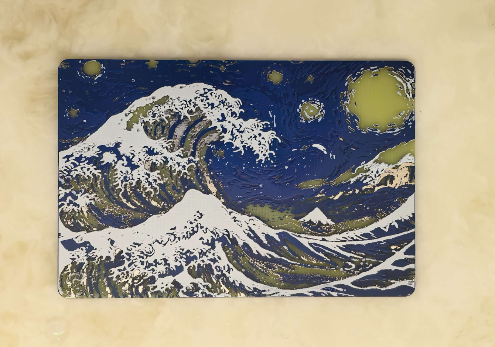

### Back

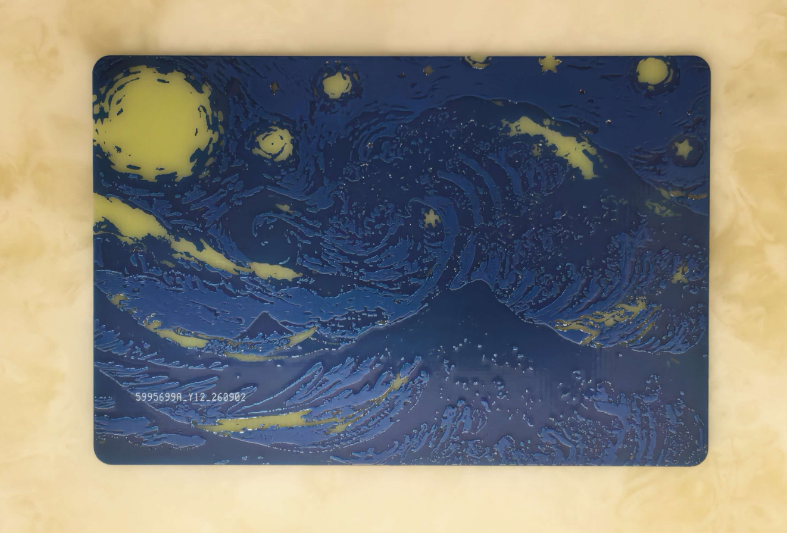

> **Important manufacturing note:**  
> The artwork PCB should use a **blue solder mask**.  
> The artwork relies on the colors and transparency of different PCB layers, so changing the solder-mask color can significantly change the final appearance.

More information about the artwork-generation tool and source image can be found in [CREDITS.md](CREDITS.md).


## Backlight Structure

The lighting system uses 40 × 2835 LEDs mounted on the rear side of the main PCB.

Each LED is operated at a much lower current than its nominal maximum rating. The LEDs are used as a distributed backlight rather than as individually high-power light sources.

### LED Array


### Diffuser

A diffuser is placed between the LED array and the artwork PCB to reduce visible LED hotspots and produce a more uniform backlight.

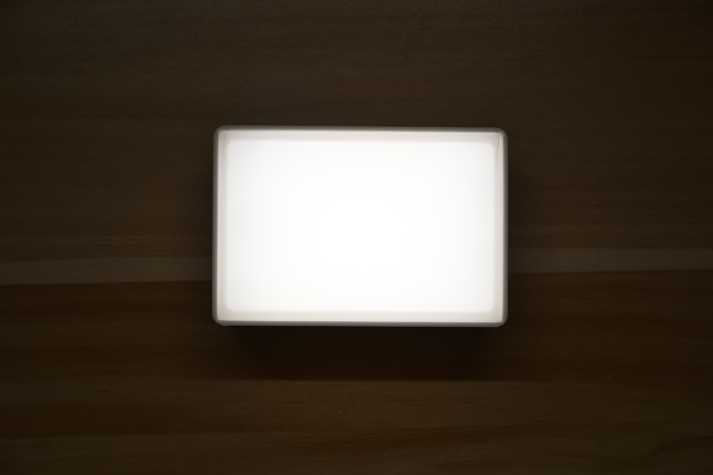

The diffuser is installed with the matte side facing the LEDs and the smooth side facing the artwork PCB.

The optical stack is approximately:

```text
Artwork PCB
↓
Diffuser
↓
Air gap
↓
40-LED main board
```


## Power System

The final design uses an IP5306 power-management IC.

The lamp is powered by one replaceable:

- 21700 Li-ion cell
- EVE Energy 50E
- 5000 mAh
- flat-top
- nominal voltage: approximately 3.6 / 3.7 V

The battery can be replaced when needed.

The PCB also includes battery reverse-polarity protection. Reverse insertion was briefly tested during development: the circuit remained inactive while the battery was reversed and operated normally again after the battery was installed with the correct polarity.


## Controls

### Top

The top side contains:

- one power button
- four battery-level indicator lights

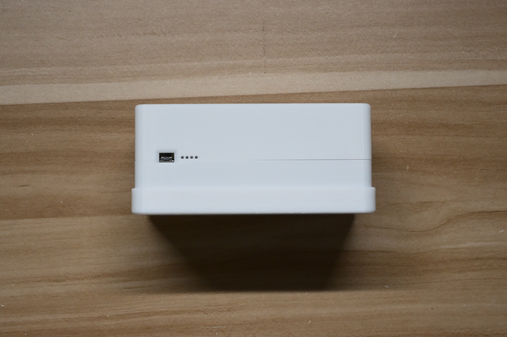

#### Power Button

- Single press: enable 5 V output
- Double press: disable output

If the LED switch is already in the ON position, the lamp will illuminate when the output is enabled.

#### Battery Indicators

The four indicators represent approximately:

- 25%
- 50%
- 75%
- 100%

During charging, the indicator corresponding to the current battery level slowly flashes.


### Right Side

The right side contains:

- brightness control
- LED on/off switch

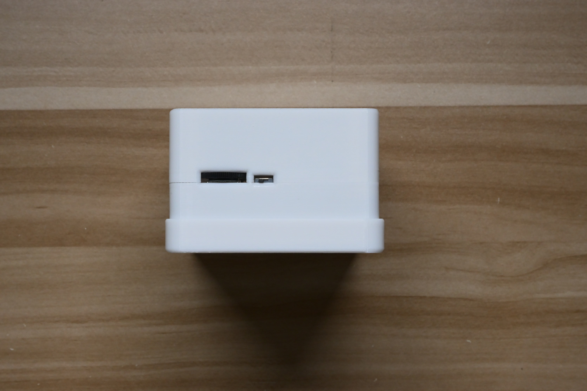

#### Brightness Control

- rotate upward: brighter
- rotate downward: dimmer

#### LED Switch

- upward: ON
- downward: OFF

This switch controls only the LED backlight.


### Left Side

The left side contains:

- USB-A output
- USB-C charging input

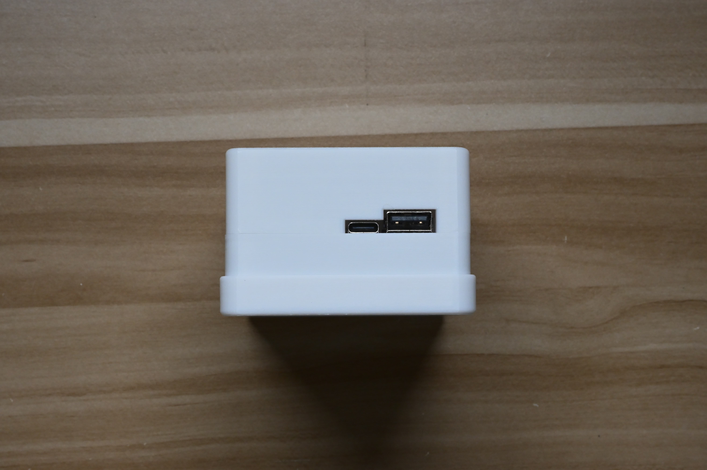

- **USB-A:** 5 V output for phones and other USB devices
- **USB-C:** charging input for the internal battery

The USB-C connector is input-only.


## Power Testing

The power-management system was tested with both the lamp on and off.

Actual input and output power depends on the connected device, battery state, cable resistance, and the charging behavior of the external device.

### USB-A Output to iPhone

#### Lamp Off

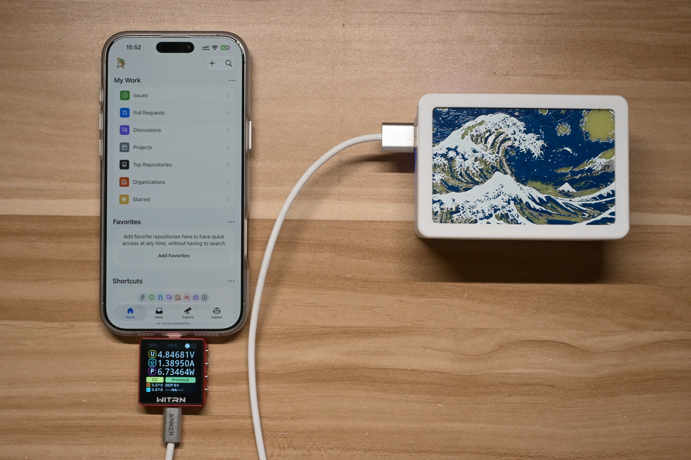

The iPhone drew approximately 6.7 W during this test.

#### Lamp On

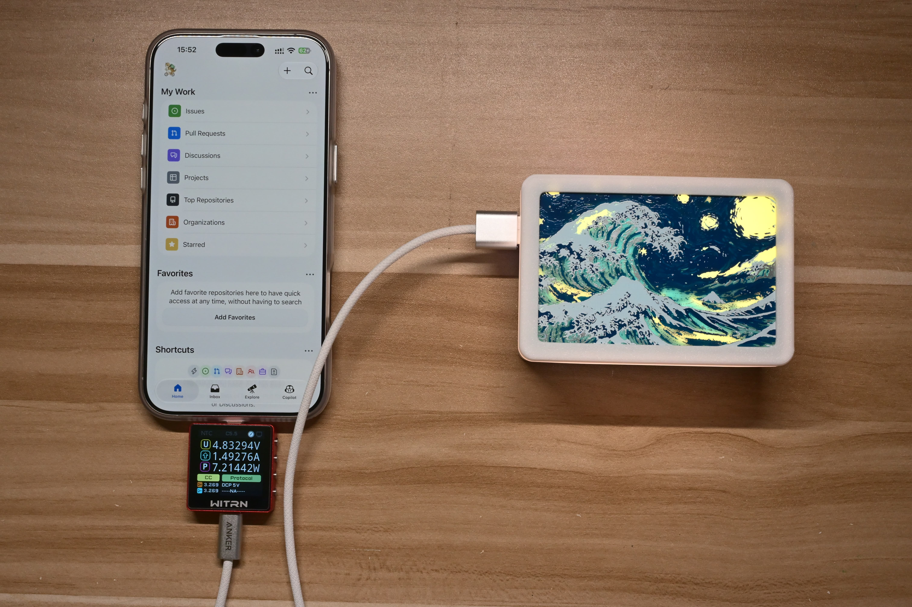

The iPhone drew approximately 7.2 W during this test.

The difference between these two measurements is due to normal variation in the phone's requested charging power and should not be interpreted as the lamp increasing USB output power.


### USB-A Output Near 10 W With Lamp On

A second lamp was used as a load to test higher USB-A output power.

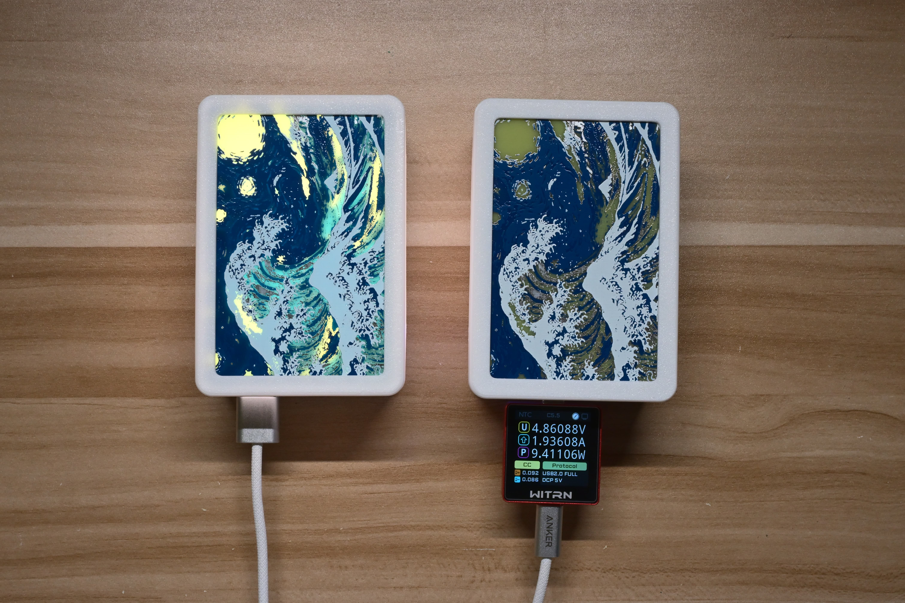

The USB-A output reached approximately 9.4 W while the source lamp remained illuminated.

This shows that the lower power observed during the iPhone tests was dependent on the connected load rather than representing a fixed USB-A output limit.


### USB-C Charging

#### Lamp Off

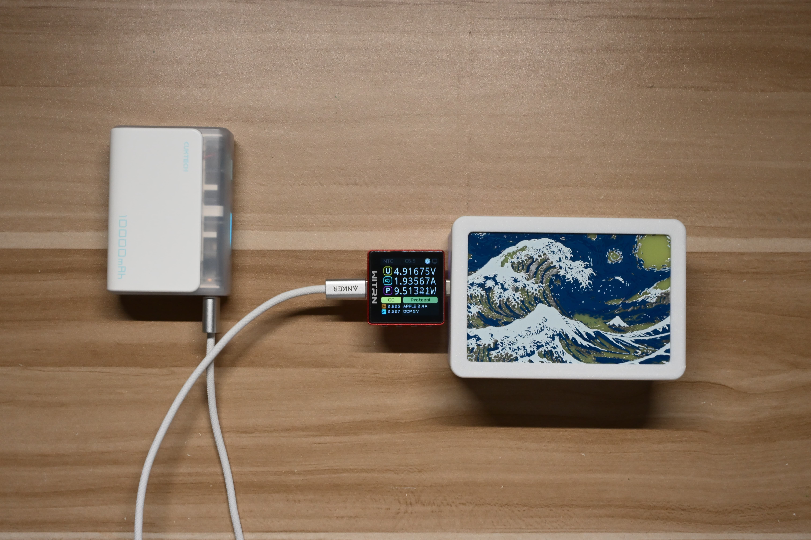

Measured charging input was approximately 9.5 W.

#### Lamp On

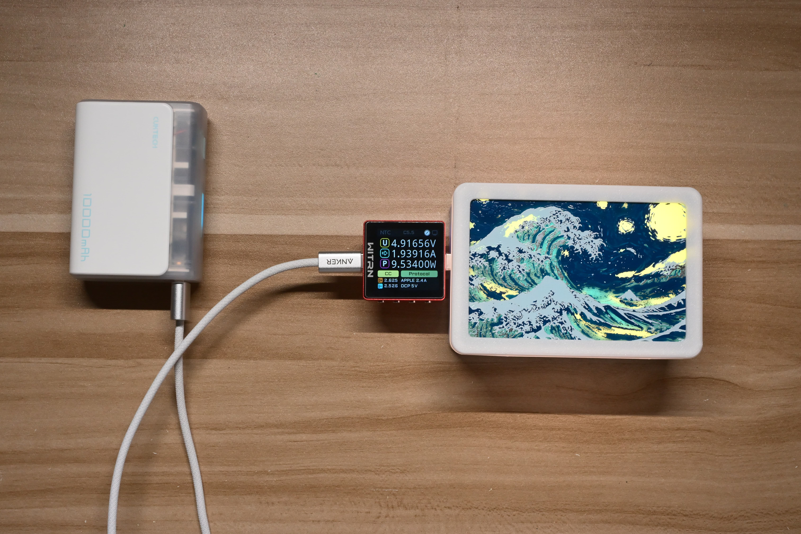

Measured charging input remained approximately 9.5 W with the lamp illuminated.


## Simultaneous Lighting and USB Operation

The LED backlight can operate while:

- the battery is charging through USB-C
- the USB-A port is supplying power to another device

In normal testing, both functions operated simultaneously without issue.

However, actual behavior depends on the connected device and instantaneous load. Under some unusual load or compatibility conditions, the power-management circuit may enter protection and disable the input or output.

If this happens:

1. Disconnect the external device.
2. Press the power button again to reactivate the output.


## USB-A / USB-C Connection Warning

Do not connect the lamp's USB-A output directly to its own USB-C input using a USB cable.

If the two ports are connected together, the power-management circuit enters protection and disables the output.

To recover:

1. Disconnect the cable between USB-A and USB-C.
2. Press the power button again.


## Enclosure

The enclosure consists of three 3D-printed parts:

- top frame
- middle frame
- bottom case

STEP and STL files are provided in the [`Mechanical`](Mechanical/) directory.

A 3MF project containing all three parts and the print setup used during fabrication is also included.

The 3MF file was prepared for a Bambu Lab X1C and contains adjusted support settings. These settings are provided as a reference and may need to be changed for other printers, materials, or slicers.


## Light Guides

The four battery-indicator LEDs use separate transparent light guides.

The light guides used in this build have the following dimensions:

- Quantity: 4
- Type: domed light guide / light pipe
- Shaft diameter: 1.0 mm
- Length: 10 mm
- Transparent plastic construction

These light guides are not included in the 3D models. The enclosure models only contain the corresponding mounting holes.

### Internal Installation

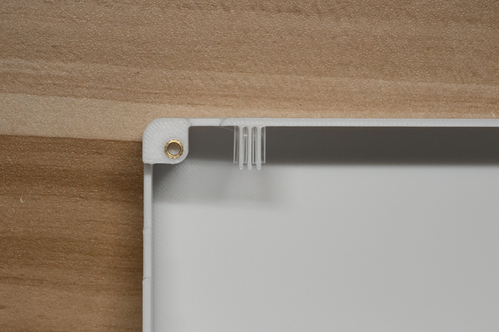

### External View

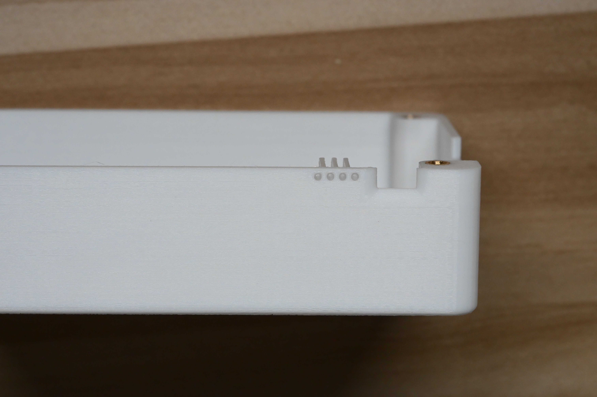

The light guides need to be purchased separately and inserted into the four indicator openings during assembly.


## Assembly

The enclosure is assembled from the bottom upward.

### Required Hardware

- 4 × M3 brass heat-set inserts
  - Height: 3 mm
  - Outer diameter: 4.2 mm
- 4 × M3 × 6 mm countersunk hex-socket screws

### Assembly Order

1. Install the four M3 heat-set inserts into the bottom case using a soldering iron.

   Press each insert into the corresponding hole until it is fully seated and aligned.

2. Place the main PCB onto the bottom case.

   The battery side of the PCB faces downward.

   Align the PCB according to the positions of the buttons, switches, potentiometer, USB ports, and the four screw holes.

3. Place the middle frame over the main PCB.

4. Secure the PCB and middle frame using the four M3 × 6 mm countersunk hex-socket screws.

5. Place the diffuser above the LED array.

   The diffuser should be installed with:

   > Matte side → LEDs
   > Smooth side → artwork PCB

6. Place the artwork PCB above the diffuser.

7. Install the top frame.

   The top frame is held in place by the built-in clips and can be pressed into position by hand.

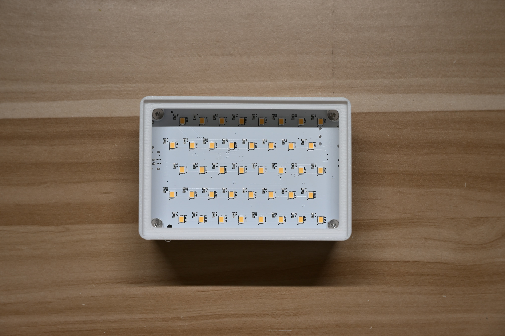


## Battery Replacement

The internal 21700 battery can be replaced when needed.

To access the battery:

1. Remove the top frame by releasing the clips by hand.
2. Remove the artwork PCB.
3. Remove the diffuser.
4. Remove the four M3 × 6 mm screws.
5. Remove the middle frame.
6. Lift out the main PCB.
7. Replace the 21700 battery.

The battery holder includes `+` and `-` polarity markings.

Always install the battery according to the polarity markings.

The circuit includes reverse-polarity protection. If the battery is accidentally inserted backward, the circuit should remain inactive. Correct the battery orientation as soon as possible before continuing to use the lamp.


## Source Files

The complete EasyEDA Pro project is provided in:

[`Hardware/Source`](Hardware/Source/)

Both project formats are included:

- `.epro` — EasyEDA Pro V2 format
- `.epro2` — EasyEDA Pro V3 format

The V3 `.epro2` file is the primary source project.


## Schematic

The complete two-page schematic is available here:

[Backlit-PCB-Art-Lamp_Schematic.pdf](Hardware/Schematic/Backlit-PCB-Art-Lamp_Schematic.pdf)

The schematic includes:

- IP5306 power-management circuit
- USB-C input
- USB-A output
- battery protection
- reverse-polarity protection
- TLC555 PWM dimming circuit
- 40-channel LED array


## Gerber Files

Production-ready Gerber archives are available in:

[`Hardware/Gerber`](Hardware/Gerber/)

Included files:

- `Main-Board_Gerber.zip`
- `Artwork-Board_Gerber.zip`

### Recommended PCB Colors

| Board | Recommended solder mask | Reason |
| --- | --- | --- |
| Artwork Board | Blue | Required for the intended artwork appearance |
| Main Board | White | Helps improve light reflection around the LED array |

The artwork-board solder-mask color is much more important than the main-board color.


## BOM

The main-board BOM is available in:

[`Hardware/BOM`](Hardware/BOM/)

The artwork PCB contains no electronic components and therefore does not require a BOM.

Some mechanical or custom parts were sourced separately and may not have standardized manufacturer part numbers.


## Mechanical Files

The [`Mechanical`](Mechanical/) directory contains:

- STEP models
- STL models
- 3MF print project

The STEP files are intended for modification or use in CAD software.

The STL files can be imported directly into most slicers.

The 3MF file contains the complete three-part print setup used for this project.


## Development History

An earlier prototype used an IP5218-based power-management design.

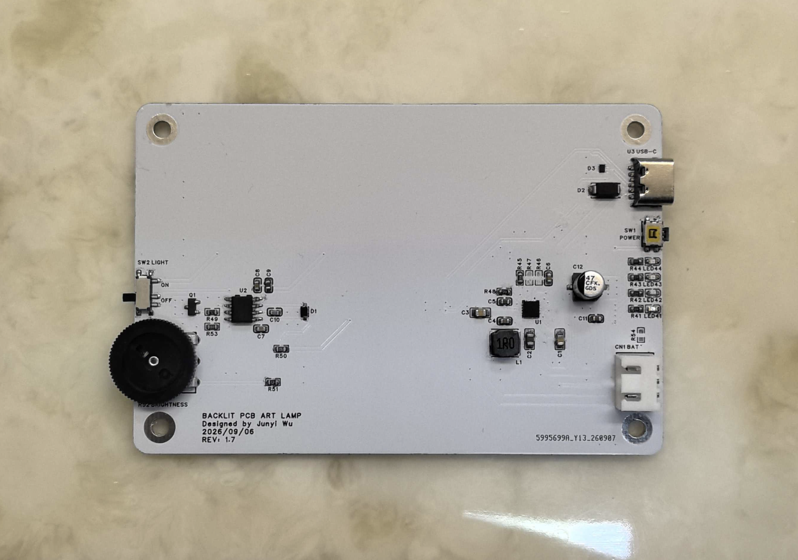

During testing, the original power section showed unresolved stability issues.

Rather than continuing to modify the original design, the power-management section was redesigned around the IP5306, together with substantial changes to the surrounding power circuitry.

The current Rev. 2.3 design documented in this repository is the working version.

The earlier prototype is included only as part of the development history and should not be treated as a production-ready design.


## Additional Photos

The README contains only selected project photographs.

Additional photos of:

- enclosure parts
- assembly
- PCB details
- diffuser
- light guides
- charging and power testing
- intermediate build stages

are available in:

[`Images/Gallery`](Images/Gallery/)


## Credits

The layered artwork used for the front PCB was created using a third-party PCB artwork-generation tool.

The AI-generated source artwork was included with the original tool package.

Full attribution and acknowledgements are available in:

[CREDITS.md](CREDITS.md)


## License

Unless otherwise noted, the original design files in this repository are released under the MIT License.

Third-party tools and source materials are not covered by this license.

See [CREDITS.md](CREDITS.md) for attribution and source information.

See [LICENSE](LICENSE) for the full MIT License text.


## Project Status

**Rev. 2.3 — Completed and tested**

The final design has been fabricated, assembled, and tested with:

- adjustable LED backlighting
- USB-C charging
- USB-A output
- simultaneous lighting and charging
- simultaneous lighting and USB-A output
- replaceable 21700 battery
- reverse-polarity protection
